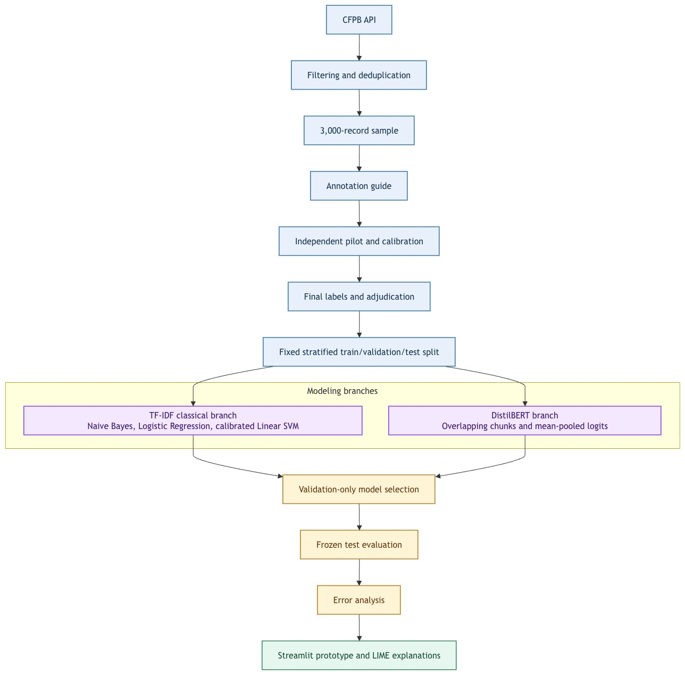
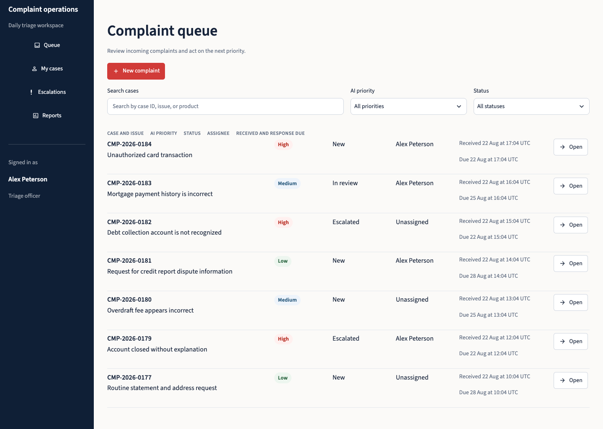

# Consumer Complaint Urgency Classification Using Natural Language Processing

An academic NLP project that classifies Consumer Financial Protection Bureau (CFPB) complaint narratives as **Low**, **Medium**, or **High** urgency. It compares three TF-IDF-based classical models with a chunked DistilBERT classifier, then demonstrates human-led triage in a Streamlit complaint-operations prototype.

## Contents

- [Project overview](#project-overview)
- [Results at a glance](#results-at-a-glance)
- [How the system works](#how-the-system-works)
- [Dataset and labels](#dataset-and-labels)
- [Repository guide](#repository-guide)
- [Getting started](#getting-started)
- [Run the prototype](#run-the-prototype)
- [Evaluation, limitations, and responsible use](#evaluation-limitations-and-responsible-use)

## Project overview

Financial-service complaints range from routine enquiries to reports of active identity theft, inaccessible funds, ongoing unauthorised transactions, and imminent housing or legal harm. This project asks a distinct triage question: **how urgently should a complaint narrative be reviewed based on the harm described in its text?**

The classifier uses the following research definitions:

| Label | Meaning |
| --- | --- |
| **Low** | Routine, resolved, informational, or minor issue without continuing material impact. |
| **Medium** | Significant unresolved issue requiring priority attention, but without explicit immediate severe harm. |
| **High** | Immediate or continuing financial, identity, housing, legal, safety, or account-access risk. |

The project delivers a reproducible data pipeline, documented annotation process, fixed train/validation/test experiment, final held-out evaluation, error analysis, and an interactive prototype that keeps a person in control of case decisions.

## Results at a glance

All selected configurations were frozen before the held-out test labels were evaluated. The primary comparison metric is macro-F1 so that Low, Medium, and High complaints contribute equally despite class imbalance.

| Model | Test accuracy | Test macro-F1 | High-urgency recall | High → Low errors |
| --- | ---: | ---: | ---: | ---: |
| Multinomial Naive Bayes | 0.7933 | 0.5535 | 0.5412 | 0 |
| Logistic Regression | 0.7644 | 0.6589 | **0.7647** | 3 |
| Calibrated Linear SVM | **0.8044** | 0.5894 | 0.6588 | 1 |
| **DistilBERT** | 0.7733 | **0.6747** | 0.7059 | 2 |

DistilBERT is the final performance recommendation because it achieved the strongest held-out macro-F1 and the most balanced class-level performance. Logistic Regression is a compelling lightweight alternative: it achieved the highest High-urgency recall and is far smaller and faster under the recorded evaluation protocol. Accuracy alone is not sufficient here—the SVM’s highest accuracy coincides with weak Low-class recovery.

See the [test-metric comparison](data/reports/figures/phase6_test_metric_comparison.svg), [per-class F1 chart](data/reports/figures/phase6_per_class_f1.svg), and complete machine-readable [test results](data/reports/phase6_test_results.json).

## How the system works



1. Retrieve published CFPB complaint narratives and retain reproducibility metadata.
2. Remove duplicate narratives and create a seeded, 3,000-record sample.
3. Apply the documented Low/Medium/High urgency guide; record annotation agreement, uncertainty, and adjudication.
4. Use one fixed stratified 70/15/15 train/validation/test split for every model.
5. Select configurations only on validation macro-F1, freeze their artifacts, then evaluate the held-out test set once.
6. Expose the frozen DistilBERT path in a synthetic, session-only Streamlit triage workspace.

### Models

- **Multinomial Naive Bayes** — lightweight probabilistic baseline.
- **Logistic Regression** — class-weighted, regularised linear baseline.
- **Calibrated Linear SVM** — class-weighted margin classifier with five-fold sigmoid calibration for confidence-compatible outputs.
- **DistilBERT** — fine-tuned `distilbert-base-uncased`; narratives are divided into overlapping 256-token chunks with stride 64 and chunk logits are mean-pooled into one document prediction.

The classical models share a training-fitted TF-IDF representation with unigrams and bigrams. DistilBERT uses minimally altered narratives and its pretrained tokenizer.

## Dataset and labels

The source is the official [CFPB Consumer Complaint Database](https://www.consumerfinance.gov/data-research/consumer-complaints/). The acquisition run retrieved 6,000 records dated from 2022-01-01 to 2025-12-31 with published narratives; after 1,445 duplicate narratives were removed, a seeded sample of 3,000 unique records was created.

The dataset has no official urgency target. Labels in this study are **AI-generated research annotations**, produced by two independent AI annotators under a written guide—not CFPB findings, expert judgments, or ground truth. The workflow records a 400-record pilot (Cohen’s kappa 0.4278), guide refinement, and a 67-record calibration round (kappa 0.7485), followed by uncertainty review and adjudication.

The final class distribution is imbalanced: 290 Low (9.67%), 2,148 Medium (71.60%), and 562 High (18.73%). The [annotation guide](docs/urgency-annotation-guide.md), [provenance record](data/processed/cfpb_data_provenance.json), [annotation manifest](data/annotation/annotation_manifest.json), and [split manifest](data/splits/split_manifest.json) support traceability.

## Repository guide

| Path | Purpose |
| --- | --- |
| `src/text_preprocessing.py` | Shared classical-text normalisation. |
| `src/prototype_inference.py` | Loading and inference helpers for the frozen DistilBERT model. |
| `src/complaint_operations.py` | Synthetic case-queue and workspace logic. |
| `notebooks/complaint_urgency_modeling_workflow.ipynb` | EDA, split, model selection, frozen final evaluation, and error analysis. |
| `streamlit_app.py` | Streamlit complaint-operations prototype. |
| `data/` | Source subset, processed/labeled data, annotation evidence, split IDs, reports, and figures. |
| `artifacts/` | Frozen vectorizer and selected model artifacts. |

## Getting started

### Prerequisites

- Python 3.10+ recommended
- `pip`
- Internet access for first-time dependency/model downloads when needed

Create and activate a virtual environment, then install the project dependencies.

### macOS / Linux

```sh
python3 -m venv .venv
source .venv/bin/activate
python3 -m pip install --upgrade pip
python3 -m pip install -r requirements.txt
```

### Windows (PowerShell)

```powershell
py -3 -m venv .venv
.\.venv\Scripts\Activate.ps1
py -m pip install --upgrade pip
py -m pip install -r requirements.txt
```

If PowerShell blocks the activation script, run this once in the current terminal session before activating:

```powershell
Set-ExecutionPolicy -Scope Process -ExecutionPolicy Bypass
```

If you prefer Command Prompt, use:

```bat
py -3 -m venv .venv
.venv\Scripts\activate.bat
py -m pip install --upgrade pip
py -m pip install -r requirements.txt
```

## Reproducing the analysis

### Inspect the completed study

Launch Jupyter and open the workflow notebook:

```sh
python3 -m jupyter lab
```

On Windows, use:

```powershell
py -m jupyter lab
```

The completed workspace contains frozen models and held-out evaluation evidence. **Do not rerun training, tuning, calibration, or test-scoring cells in this copy.** From a clean kernel, use the notebook section headed **“Phase 6 — Frozen held-out evaluation and error analysis”** to verify hashes and load the saved result bundle without rescoring the test set.


## Run the prototype

Launch the Streamlit application from the repository root.

### macOS / Linux

```sh
streamlit run streamlit_app.py
```

### Windows

```powershell
streamlit run streamlit_app.py
```

If `streamlit` is not recognised, run it through Python instead:

```powershell
py -m streamlit run streamlit_app.py
```

The prototype opens to a populated **synthetic** complaint queue. You can search and filter cases, open a case workspace, record session-only notes and status changes, and add a new synthetic complaint. A valid new narrative is automatically triaged with the frozen DistilBERT artifact at `artifacts/models/distilbert`; the app can also show an on-demand local explanation.



Key safeguards:

- Use synthetic text only. Do not enter personal information, account details, or live customer data.
- The prototype does not retrain, tune, replace, or overwrite frozen artifacts.
- Queue state, assignments, notes, and status updates are session-only and disappear when the browser session ends.
- AI priority and explanations support human review; they do not determine real-world outcomes.

## Evaluation, limitations, and responsible use

The final evaluation used the same 450-record held-out test set for every frozen model. It reports aggregate and per-class metrics, confusion matrices, High-urgency recall, High-to-Low errors, inference timings, approximate artifact sizes, LIME explanation timings, and representative error analysis. The experiment records artifact hashes in [the freeze manifest](data/reports/phase6_freeze_manifest.json).

Important limitations include:

- Labels are AI-generated and require independent domain-expert validation.
- The dataset is imbalanced and the Low/High test supports are limited (43 and 85 records respectively).
- CFPB published narratives are not representative of all consumers, products, locations, time periods, or complaint channels.
- Narratives may omit decisive context and are not verified facts.
- Mean-logit chunk aggregation may dilute short urgent passages in long documents.
- Model scores are not guarantees of correctness; LIME explanations are local, approximate, non-causal, and may be unstable.

Before any real deployment, the approach would need expert label validation, privacy and security review, calibration and fairness testing, external and temporal validation, drift monitoring, audit controls, and an explicit human appeal/correction process.
